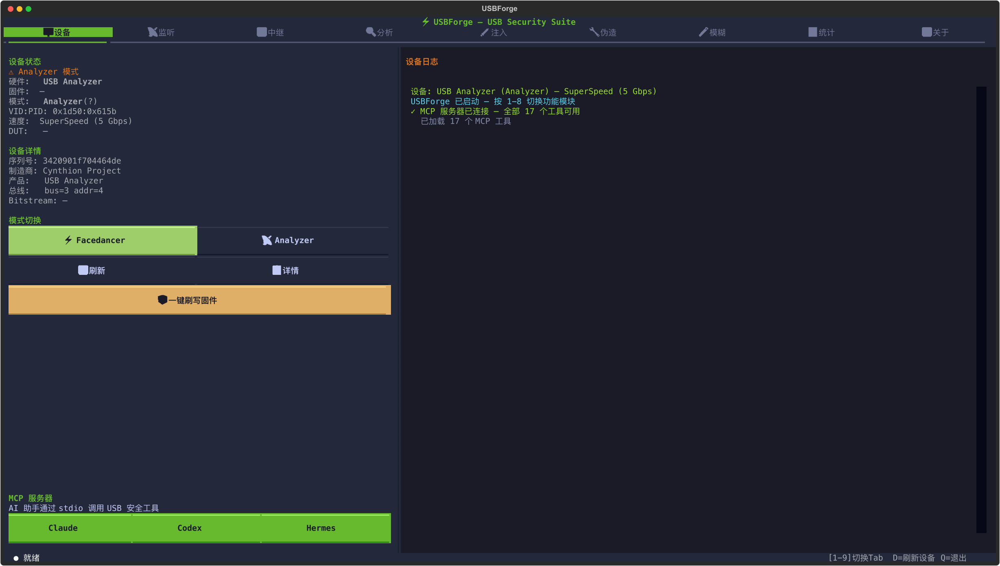
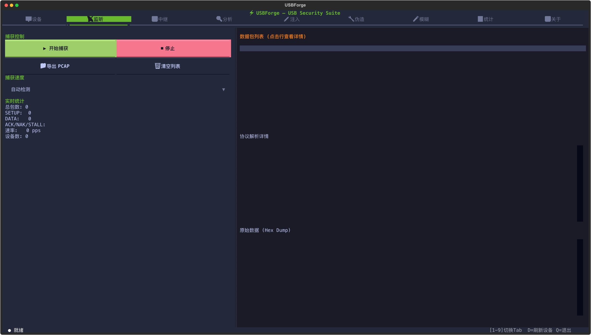
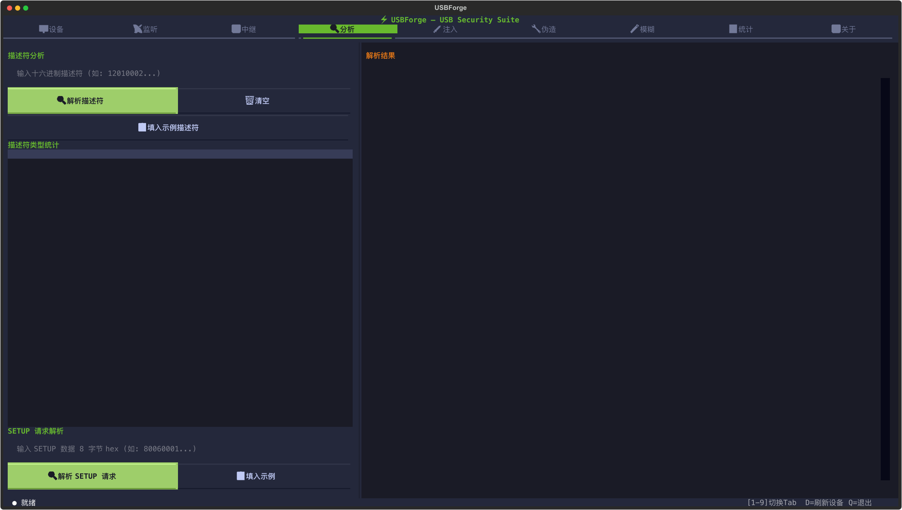
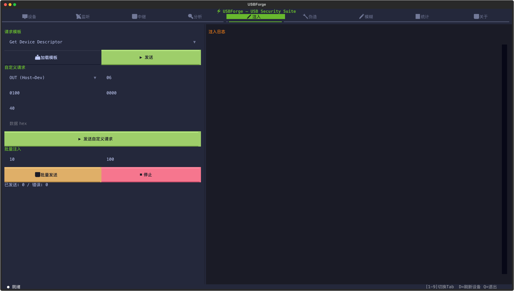
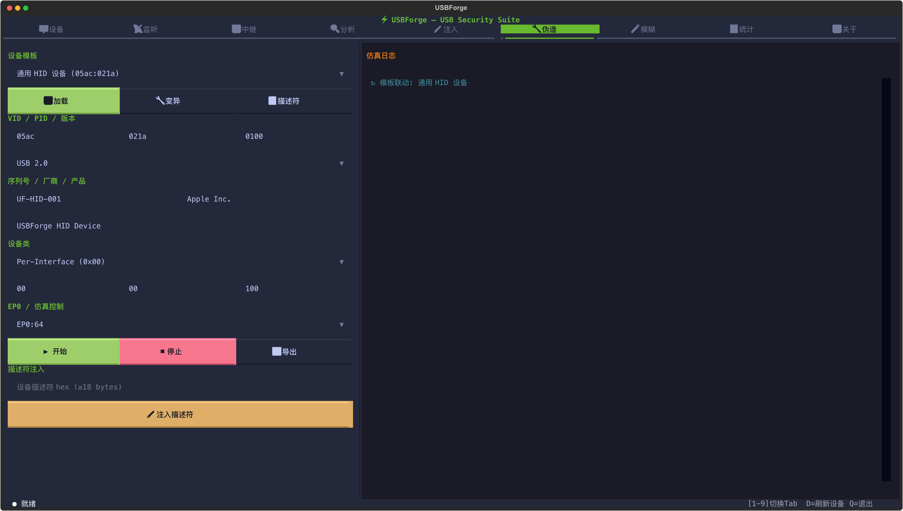
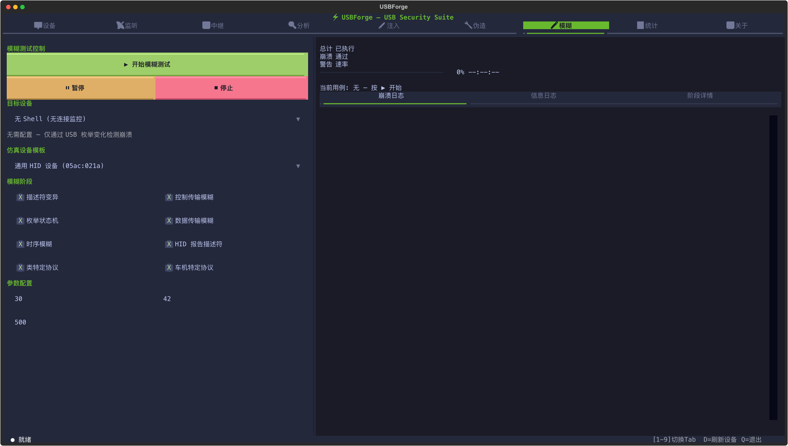
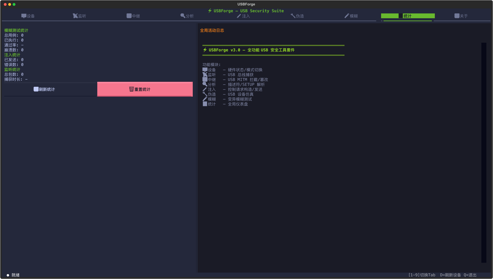
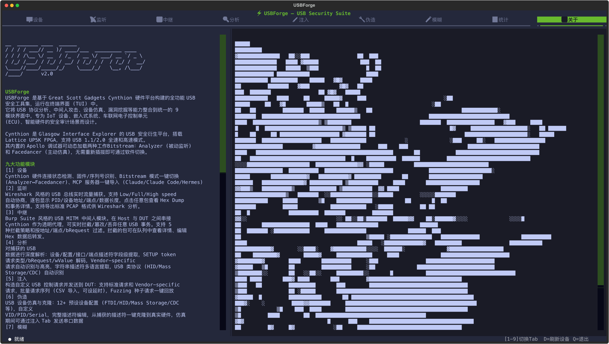

# ⚡ USBForge

**基于 Cynthion 的全功能 USB 安全工具套件** · `v3.0`

USBForge 是一个集成了 USB 总线监听、MITM 中继、流量分析、数据包注入、设备伪造、模糊测试于一体的终端 (TUI) 安全工具。底层基于 [Cynthion](https://github.com/greatscottgadgets/cynthion) 硬件平台和 [Facedancer](https://github.com/greatscottgadgets/facedancer) 框架，提供图形化的交互操作界面，专为 IoT 设备、嵌入式系统、智能硬件的 USB 协议安全审计场景设计。

---

## 📸 界面预览

### 设备管理


### 总线监听


### 流量分析


### 数据包注入


### 设备伪造


### 模糊测试


### 全局统计


### 关于页面


---

## ✨ 功能模块

| # | 模块 | 图标 | 功能描述 |
|---|------|------|----------|
| 1 | **设备** | 🖥 | Cynthion 硬件状态检测、Bitstream 模式一键切换 (Analyzer↔Facedancer)、MCP 服务器一键导入 |
| 2 | **监听** | 📡 | Wireshark 风格的 USB 总线实时流量捕获，支持 Low/Full/High Speed，PCAP 导出 |
| 3 | **中继** | 🔄 | Burp Suite 风格的 USB MITM 中间人模块，实时拦截/篡改/丢弃 USB 事务 |
| 4 | **分析** | 🔍 | USB 描述符字段级解析 (Device/Config/Interface/Endpoint)、SETUP 事务解码、Vendor Request 自动发现 |
| 5 | **注入** | 💉 | 自定义 USB 控制请求构造与发送、标准/Vendor 请求、批量发包、Fuzzing 种子回放 |
| 6 | **伪造** | 🔧 | USB 设备仿真 (HID/Mass Storage/CDC/Hub 等 12+ 预设)、描述符克隆与变异、VID/PID 自定义 |
| 7 | **模糊** | 🧪 | 多阶段智能 USB 模糊测试引擎 (描述符枚举 → Vendor 探索 → 变异 fuzz)，崩溃自动收集 |
| 8 | **统计** | 📊 | 全局活动仪表盘，模糊/注入/监听/中继综合统计，实时活动日志 |
| 9 | **关于** | ℹ️ | 工具介绍、MCP 集成说明、快捷键、硬件要求、技术栈 |

---

## 🚀 快速开始

### 环境要求

- **硬件**: [Cynthion](https://greatscottgadgets.com/cynthion/) r0.6+ (Lattice UP5K FPGA)
- **Python**: 3.12+
- **依赖**: cynthion, luna-soc, facedancer, textual, rich, pyusb

### 安装

```bash
git clone https://github.com/da1sy/USBForge.git
cd USBForge

# 创建虚拟环境
python3 -m venv .venv

# 安装依赖
.venv/bin/pip install cynthion facedancer textual rich pyusb pyfiglet
```

### 运行

```bash
./run.sh
```

### 快捷键

| 按键 | 功能 |
|------|------|
| `1`-`9` | 切换功能模块标签页 (设备/监听/中继/分析/注入/伪造/模糊/统计/关于) |
| `D` | 刷新设备状态 |
| `Q` | 退出 |
| 鼠标 | 全部功能支持鼠标点击操作 |

---

## 🏗 架构

```
USBForge/
├── tui.py              # 主 TUI 界面 (9 Tab + 暗色主题)
├── device.py           # Cynthion 硬件检测与模式管理
├── sniffer.py          # USB 总线监听后端 (Analyzer)
├── injector.py         # 数据包构造/注入/重放后端
├── emulator.py         # USB 设备仿真后端 (Facedancer)
├── monitor.py          # 崩溃检测监控 (NoShell/UserShell/RootShell)
├── strategy.py         # 模糊测试策略引擎
├── usb_fuzzer.py       # 核心模糊执行器
├── mcp_bridge.py       # MCP 服务器桥接层 (JSON-RPC 2.0)
├── run.sh              # 启动脚本
├── screenshots/        # 工具截图
├── exports/            # 描述符导出文件
└── corpus/             # 模糊测试崩溃语料
```

---

## 🎯 使用场景

### 1. USB 攻击面探测
- 切换到 Analyzer 模式，监听目标设备与 Host 之间的 USB 通信
- 分析描述符，识别设备类型和潜在攻击面
- 提取厂商自定义请求 (Vendor Request)，发现隐藏功能

### 2. USB 设备克隆与中间人
- 捕获目标设备描述符
- 切换到 Facedancer 模式，仿真克隆设备
- 使用中继模块在 Host↔DUT 之间实时拦截和篡改数据

### 3. 协议模糊测试
- 选择目标 Profile (HID/MassStorage/CDC 等)
- 配置监控模式 (ADB/SSH) 检测崩溃
- 多阶段变异策略自动生成测试用例
- 崩溃自动收集到 `corpus/` 目录

### 4. AI 助手集成 (MCP)
- 内置 Cynthion MCP 服务器，提供 17 个工具供 AI 助手调用
- 支持 Claude / Claude Code / Hermes Agent
- 在设备页一键导入 MCP 配置

---

## 🤖 MCP 服务器集成

USBForge 内置 Cynthion MCP 服务器，通过 stdio JSON-RPC 2.0 协议为 AI 助手提供 USB 硬件操控能力：

| 工具 | 功能 |
|------|------|
| `capture_start/stop` | 启动/停止 USB 流量捕获 |
| `dissect_packets` | tshark 级逐包解析 |
| `find_vendor_requests` | Vendor SETUP 自动发现 |
| `switch_mode` | 切换 Analyzer/Facedancer bitstream |
| `emulate_device` | 启动 USB 设备仿真 |
| `emulate_from_descriptor` | 从原始描述符克隆设备 |
| `inject_serial` | 向仿真设备注入串口数据 |
| ... | 共 17 个工具 |

配置方法：在设备页右下角点击对应 AI 助手的导入按钮，自动写入配置文件。

---

## 🎨 设计

- **主题**: 暗色科技风（背景 `#1A1B26`，品牌绿 `#68B92E`，强调橙 `#E77817`）
- **布局**: 左右分栏（左侧控制面板 + 右侧日志/结果），9 Tab 导航
- **交互**: 全鼠标可操作 + 键盘快捷键
- **框架**: [Textual](https://textual.textualize.io/) 8.x

---

## 📋 Cynthion 模式说明

| Cynthion 模式 | PID | 用途 |
|---------------|-----|------|
| Analyzer | 0x615E | USB 总线监听（被动嗅探） |
| Facedancer | 0x615B | USB 设备仿真（主动伪造） |
| Stub/Debugger | 0x615C | 默认模式（需切换） |

---

## 📜 技术栈

| 组件 | 版本 | 说明 |
|------|------|------|
| Python | 3.12+ | 主语言 |
| Cynthion SDK | luna-soc 0.3.x | 硬件抽象层 |
| Facedancer | 3.1+ | USB 仿真框架 |
| Textual | 8.x | 终端 UI 框架 |
| MCP | JSON-RPC 2.0 | AI 助手工具集成 |

---

## ⚠️ 免责声明

本工具仅供安全研究和授权测试使用。在使用前，请确保您已获得目标系统的明确授权。未经授权的 USB 安全测试可能违反相关法律法规。

---

## 📄 License

MIT
